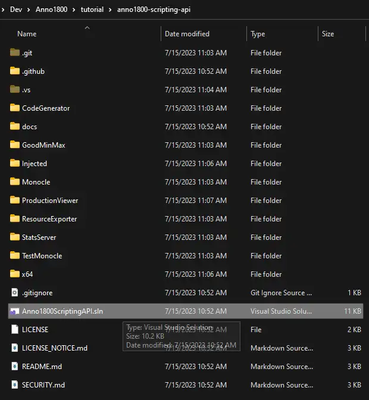

# Build instructions

## Requirements

- [Visual Studio Community 2019 or later](https://visualstudio.microsoft.com/vs/community/)
- **Optional** Git: only needed if you want to keep up-to-date with the upstream repository, you can just download the zip from the repo if you don't care. you can find git on [git-scm](https://git-scm.com/download/win/), [git-for-windows](https://gitforwindows.org/), or use the GUI [Github Desktop](https://desktop.github.com/)

## 1. Visual Studio 2019 installation

Please select both `.Net desktop development` and `Desktop development with C++` during the installation process. Those are required to build the various programs of this project.

## 2. Get the source files

### a. EITHER Clone the repository to keep up-to-date with changes

Open a terminal in the directory of your choice and type `git clone git@github.com:egomeh/anno1800-scripting-api.git`. If you don't have a registered SSH key on github -:warning:[you should](https://docs.github.com/en/authentication/connecting-to-github-with-ssh/generating-a-new-ssh-key-and-adding-it-to-the-ssh-agent):warning:-, you can use the **https** version `git clone https://github.com/egomeh/anno1800-scripting-api.git`.

### b. OR Download the zipped sources

You can press the green button at the top right of the repository and download the zip. Unzip the source where you want on your PC.

## 3. Build the solution

Go to the project's folder. Double-click on `Anno1800ScriptingAPI.sln` to open it in Visual Studio.

Then open the `Build` menu at the top and select `Build solution` or press `Fn6`.

## 4. Enjoy

You can now select the project you want and run them in `debug` or `release` mode.

